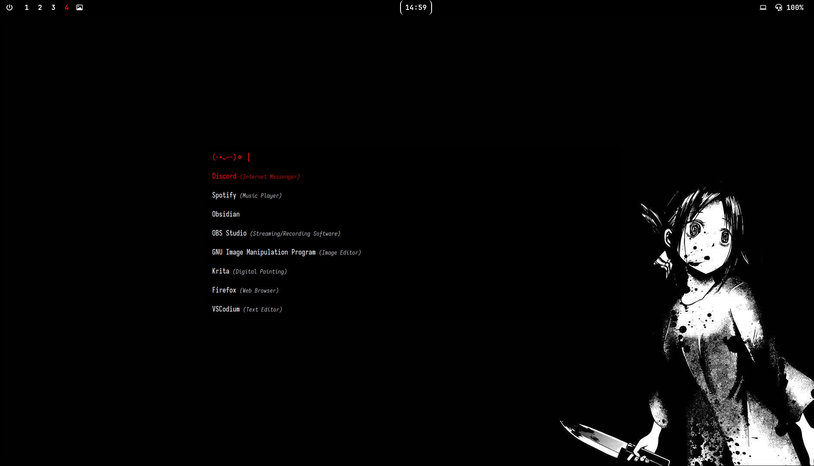
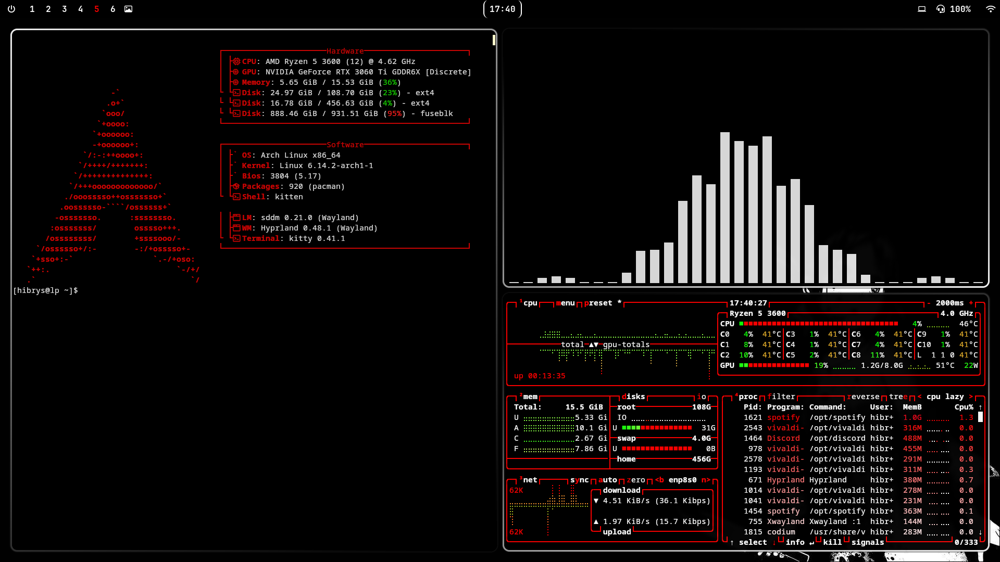
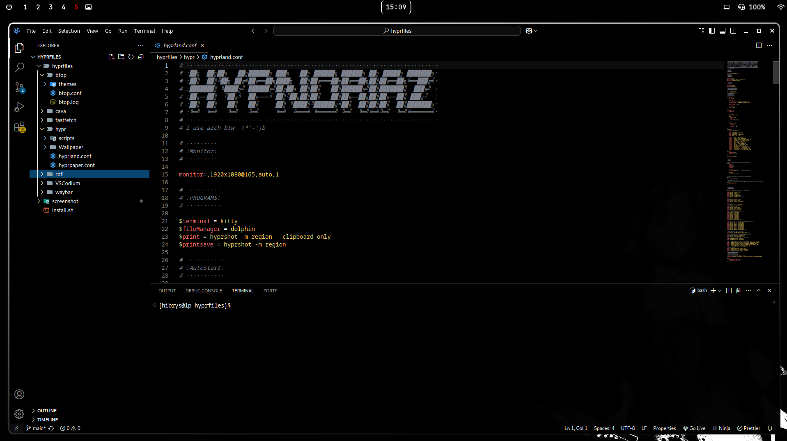

[](https://git.io/typing-svg)

Personal settings for the Hyprland environment on Arch Linux, with an automated installation script.

---

## Applications included

- **Hyprland** (WM)
- **Waybar** (Status bar)
- **Rofi** (Launcher)
- **Btop** (System monitor)
- **Cava** (Audio visualizer)
- **Fastfetch** (Splash info)
- **VSCodium** (Code Editor)
- **Vivaldi** (Browser)
- **Hyprpaper** (Wallpaper)
- **Pavucontrol** (Audio control)
- **Shotwell** (Image Viewer/Manager)

---

## ⚙️ Instalação

> ⚠️ Recommended to use on **Arch Linux** or based on it (such as EndeavourOS, Artix, etc).

1. Clone the repository and install:
```bash
git clone https://github.com/Hypnoria/dots-hyprland.git
cd dots-hyprland
bash install.sh
```
# Preview

<p align="center">
  
</p>

<p align="center">
  
</p>

<p align="center">
  
</p>
